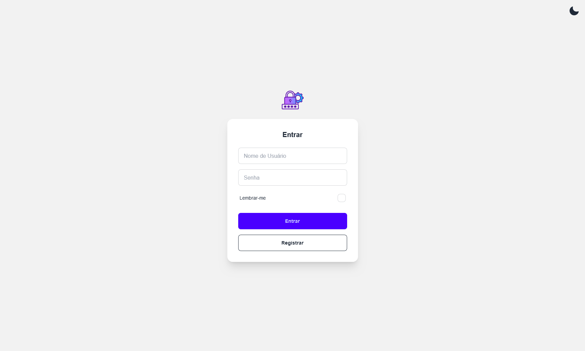
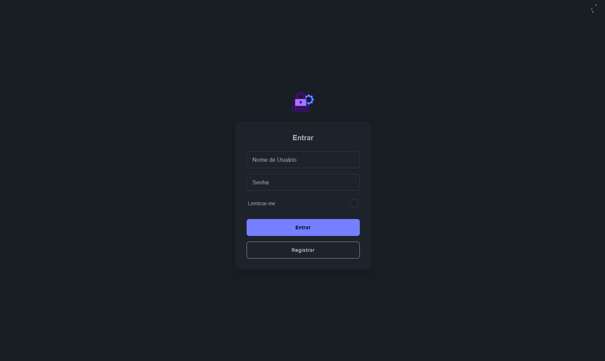
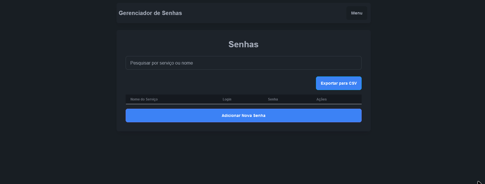

# Password Manager

Gerenciador de senhas seguro construído com Django e Tailwind CSS + DaisyUI. Oferece autenticação de dois fatores (TOTP) e criptografia para armazenamento seguro de senhas.

## 🚀 Tecnologias

- Python 3.x
- Django 5.1.4
- Tailwind CSS
- DaisyUI
- django-otp 1.5.4 (Two-Factor Authentication)
- cryptography 44.0.0
- python-dotenv 1.0.1
- qrcode 7.4.2
- django-widget-tweaks
- SQLite / PostgreSQL

## 📋 Pré-requisitos

- Python 3.x
- Node.js e npm
- pip (Python Package Manager)

## 🔧 Instalação

1. Clone o repositório
```bash
git clone https://github.com/seu-usuario/password-manager.git
cd password-manager
```
2. Crie e ative o ambiente virtual
```bash
python -m venv venv
.\venv\Scripts\activate
```
3. Instale as dependências
```bash
pip install -r requirements.txt
```

## 🚀 Como usar

1. Execute as migrações do banco de dados
```bash
python manage.py migrate
```
2. Inicie o servidor de desenvolvimento
```bash
python manage.py runserver
```
3. Acesse o aplicativo no navegador
```
http://127.0.0.1:8000
```

## 🔐 Recursos

- Autenticação de dois fatores (TOTP)
- Armazenamento seguro de senhas
- Interface responsiva com Tailwind CSS e DaisyUI
- Tema claro e escuro
- Componentes interativos (dropdowns e modais)
- Criptografia de dados sensíveis
- Gerenciamento de múltiplas senhas
- QR Code para configuração TOTP

## 📸 Exemplos

### Tela de Login

| Tema Claro | Tema Escuro |
|------------|-------------|
|  |  |

### Componentes Interativos

| Dropdown | Modal |
|----------|-------|
|  |  |

## 🛠️ Desenvolvimento

Para compilar o CSS em tempo real durante o desenvolvimento:
```bash
npm run dev
```

## 🔒 Segurança

- Todas as senhas são criptografadas antes do armazenamento
- Autenticação de dois fatores obrigatória
- Tokens TOTP com validade de 60 segundos
- Variáveis sensíveis protegidas em arquivo .env

## 📝 Licença

Este projeto está sob a licença MIT. Veja o arquivo LICENSE para mais detalhes.
